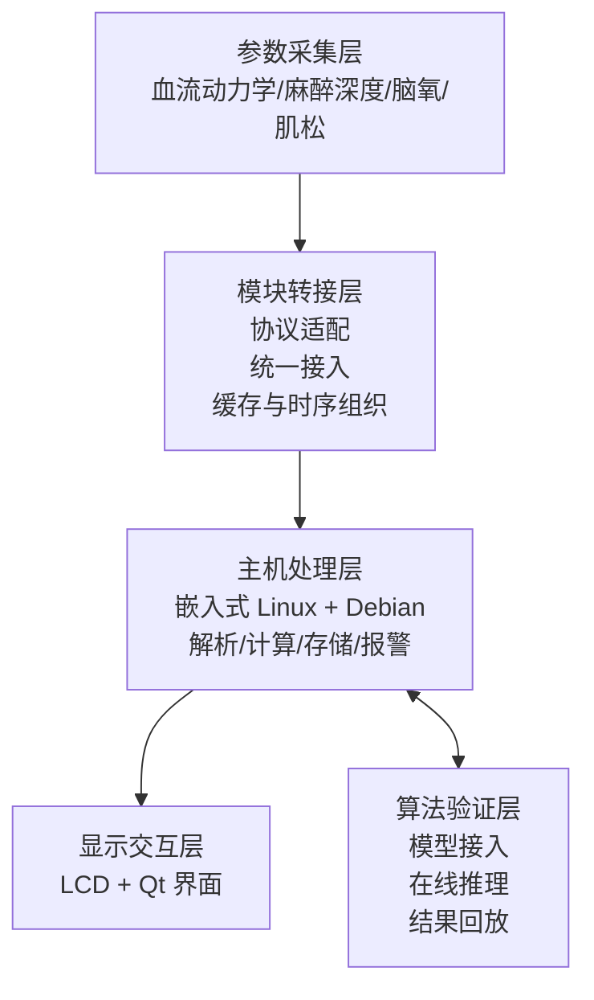
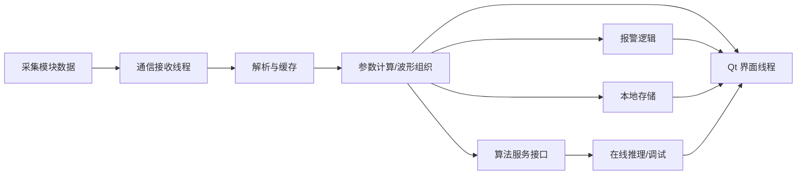

# 手术室多参数智能监护系统章节修订与引文审校报告

## 执行摘要

本次审校的结论可以概括为三点。其一，原章的技术主线是成立的：以手术室围术期监护为场景，以多参数统一接入、时间同步、异构主机平台和开放算法验证为核心，整体方向与多功能患者监护设备的标准框架以及术中关键参数监测需求是一致的。其二，当前文本的主要问题并不在技术方案本身，而在论述层次和语言组织上：同一定位——“临床监护设备 + 算法验证平台”——在多个段落中反复回指，造成目标、方案、平台价值三者之间的逻辑边界不够清楚。其三，参考文献层面的薄弱点主要集中在标准版本未细化、器件/模块引用缺少一手资料、以及若干过于具体但目前缺少公开官方证据支撑的性能判断。citeturn38view1turn31search5turn20search10turn33view3turn33view0

从引文审校结果看，第二章中需要文献支撑的内容大致分为三类：一是标准与规范，如通用电气安全、EMC、多功能监护仪专项要求及报警系统相关标准；二是产品、芯片和软件框架，如 i.MX 8M Plus、AD7124-8、EGOS-600 系列、NMT 模块、Debian、Qt、Buildroot、Yocto 等；三是技术方法与论断，如近红外组织氧监测的理论基础、PTT 的医学背景、量化神经肌肉监测的临床意义、以及不同主机平台的优劣比较。就公开可核验资料而言，entity["organization","IEC","standards body"]、entity["company","NXP Semiconductors","chipmaker"]、entity["company","Analog Devices","semiconductor company"]、entity["company","Mindray","medical device company"]、entity["company","苏州爱琴生物医疗电子有限公司","medical device company"]、entity["company","深圳市惟拓力医疗电子有限公司","patient monitor company"]、entity["organization","IEEE","professional association"]、entity["organization","Bluetooth SIG","standards consortium"]、entity["organization","Debian Project","software project"]以及entity["organization","American Society of Anesthesiologists","medical society"]提供了最关键的一手来源。citeturn31search0turn31search5turn38view1turn26view0turn26view1turn17view0turn28search0turn26view2turn18view1turn18view0turn26view4turn33view3

本次修订稿在保留原有章节结构与技术细节的前提下，重点做了四类处理：一是重排论证顺序，使“设计原则—总体目标—总体方案—主机选型—采集方案—软件平台”形成单向推进关系；二是统一术语，压缩重复表述，减少“开放算法验证平台”“临床落地与科研支撑双重需求”等同义重复；三是对平台选型部分的若干绝对化、经验化措辞进行弱化或改写，使其更符合论文写作的审慎表达；四是对能够核验的标准、器件、模块、软件框架补齐来源，对当前无法核验的一手资料明确标记为“待补证”，避免形成“看似有出处、实则不可追溯”的参考文献风险。citeturn31search0turn31search5turn38view1turn16view1turn16view0turn16view2turn20search10turn20search4

## 修订思路与核心改动

本次修订遵循两个原则。第一，**不改变你的章节结构和技术主张**，只对逻辑连接、学术语体和冗余表达进行深度整理。第二，**凡涉及标准、器件、具体产品、软件框架、协议、算法原理或带有定量色彩的技术判断，均按“能核验则给 RIS，不能核验则明确标记待补”处理**。这种做法比“先写进去、以后再补”更安全，也更符合学位论文后期定稿的规范流程。citeturn31search0turn31search5turn38view1turn16view1turn16view0

本轮修订中，最重要的结构性调整有以下几项：

- 将“系统定位”从多个段落的重复回指，收束到 2.1 和 2.1.2 两处，后文不再反复铺陈。
- 将“设备孤岛、时间基准不一致、封闭架构”统一设定为前文问题定义，后续各节分别对应到接入层、同步层、主机层与软件层，避免同一问题在不同节中重复展开。
- 将平台选型部分由“逐项否定”改为“适用边界比较 + 本文需求匹配”，提升学术语体的客观性。
- 对若干缺乏公开一手证据的表述进行了降阶处理，例如把“绝对不适合”“无法满足”改为“难以在不增加额外复杂度的前提下满足”“更适合作为局部加速或子模块平台”。
- 删除或弱化了若干过于具体但来源不足的数值型判断，例如 MCU 统一写成“主频通常低于 200 MHz”“Flash 擦写寿命约 1 万次”、FPGA/x86 的统一功耗区间、以及 i.MX8M Plus 关于“IEC 60601 预认证”“ResNet‑50 单帧 <3 ms、30 倍提速”等表述。
- 对厂商/型号信息做了谨慎处理：EGOS‑600 系列和 Witleaf M901 NMT 可由官方页面支撑；“西班牙 Biosignals 麻醉深度模块”目前未检得可直接核验的官方一手资料，因此在修订稿中统一改为“外购麻醉深度监测模块”，并在后文单列为待补证项。citeturn28search0turn26view2turn17view0turn35view0turn16view2turn26view0turn16view1

## 第二章修订稿

说明：以下修订稿**保留原有章节编号与技术内容框架**，但已对语言、逻辑和冗余表述进行了系统整理。段末所附来源说明仅用于本次审校报告展示；论文定稿时，可按学校格式改为顺序编码参考文献。

**第二章 手术室多参数智能监护系统总体方案设计与关键技术路线论证**

**2.1 系统设计原则与总体目标**

手术室多参数智能监护系统的设计，应同时面向围术期复杂临床场景与多模态算法验证需求。与普通病房或常规 ICU 场景相比，手术室环境具有患者生理状态变化快、监测参数种类多、设备协同强、布线复杂以及电磁干扰环境严苛等特点，因此对监护系统的实时性、连续性、集成性与可靠性提出了更高要求。尤其在心胸外科、神经外科及其他高风险手术中，麻醉深度、脑组织氧饱和度、血流动力学和神经肌肉阻滞程度等关键参数，直接关系到术中评估与麻醉管理质量，监护系统不仅要完成稳定采集与显示，还应支持多源数据的统一组织与关联分析。多功能患者监护仪的专项标准也强调，此类设备应在多生理参数联合监测场景下满足基本安全与基本性能要求。citeturn38view1turn20search10turn33view0turn33view3turn20search3

与此同时，当前手术室中与患者监护相关的设备通常由不同厂商分别提供，设备在硬件接口、通信协议、采样机制和时间基准等方面差异较大，容易形成“设备孤岛”。这种分散化部署方式不利于多模态生理数据的统一接入、时序一致性管理和协同分析，也难以满足科研算法对标准化接口、统一数据结构和可追溯时间基准的要求。因此，本文将系统定位为**“面向临床应用的手术室多参数监护设备”与“面向科研院所的开放算法验证平台”相结合的嵌入式系统**，并据此明确系统设计原则与总体目标。citeturn38view1turn31search5turn20search10turn33view0

**2.1.1 手术室场景下的系统设计原则**

围绕上述定位，本文在系统设计中主要遵循以下原则。

第一，系统应围绕围术期关键参数构建监护能力。在基础生命体征之外，重点支持麻醉深度、脑组织氧饱和度、血流动力学及肌肉松弛等参数的接入、显示与记录，提升监护信息完整性，并为多模态融合算法提供质量较高的数据源。citeturn20search3turn20search10turn33view0turn33view3

第二，系统应具备多模块统一接入与集中管理能力。由于不同监测模块在接口形式、协议封装与运行方式上存在差异，系统应通过统一接入层和模块化管理机制，将原本分散的监测单元组织到同一平台中，实现集中显示、统一配置与统一数据调用。这样既有利于提升临床使用便利性，也为后续算法验证提供一致的数据入口。citeturn38view1turn17view0

第三，系统应突出关键生理信号的同步组织能力。多参数监护的价值不仅在于“同时看到多个参数”，更在于不同参数能够在统一时间基准下进行关联分析。无论是趋势判断、状态评估，还是脉搏传导时间等复合指标计算，都依赖可靠的时序一致性。因而，系统设计必须把时间同步和数据组织能力作为核心技术要求，而非附属功能。citeturn20search4turn33view0

第四，系统应兼顾可扩展性与临床适配性。主机平台既要具备足够的计算资源和接口资源，也应具有良好的软件生态和后续算法接入能力；同时，整机还需满足手术室环境下对稳定性、可维护性、抗干扰能力和部署灵活性的要求，使其既能服务当前临床应用，也能支撑后续功能升级与算法迭代。citeturn31search5turn16view1turn16view2

**2.1.2 系统总体设计目标**

基于上述设计原则，本文拟构建一套面向手术室场景的多参数智能监护系统，在统一嵌入式主机平台上实现关键监测模块的接入、管理与显示，建立面向多模态生理信号的同步采集与数据组织能力，并为多模态融合算法和智能监护算法提供开放、标准化的开发与验证环境。系统设计既服务于术中实时监护，也为后续算法在线部署、离线复盘和临床转化预留平台基础。citeturn38view1turn16view1turn16view2

具体而言，系统总体目标包括四个方面：其一，实现麻醉深度、脑氧、血流动力学和肌肉松弛等关键参数的统一接入与集中显示，构建适配手术室场景的综合监护平台；其二，实现关键生理信号的同步采集与统一数据管理，保证多源数据具备可用于联合分析的时序一致性；其三，构建具备一定算法扩展能力的嵌入式主机平台，支持算法接入、在线调试与结果验证；其四，在手术室复杂环境下保障系统的稳定运行、维护便利与部署灵活性，使临床实用性和科研支撑性得到统一。citeturn38view1turn31search5turn16view1turn16view2

表2-1给出了系统总体设计目标与实现要求之间的对应关系。

| 设计目标 | 对应需求 | 实现要求 |
|---|---|---|
| 多参数统一监护 | 麻醉深度、脑氧、血流动力学、肌松等参数集中管理 | 支持多模块统一接入、集中显示与统一配置 |
| 多模态同步组织 | 多源信号联合分析、趋势判断与算法验证 | 建立统一时间基准与统一数据组织机制 |
| 智能平台扩展 | 后续高级算法与智能功能扩展 | 采用可扩展主机平台，预留标准化算法接口 |
| 稳定可靠运行 | 手术室复杂环境下长期工作 | 强化可靠性、可维护性与抗干扰设计 |
| 灵活部署应用 | 适应复杂布线、移动转运与设备布局 | 支持模块化设计及无线/有线混合接入 |

表2-1所述目标与实现要求，是后续总体方案设计、主机选型、模块接入和软件架构设计的统一依据。其基本约束来自多功能患者监护仪的通用标准框架、EMC 与报警相关要求，以及手术室围术期关键监测指标的临床需求。citeturn38view1turn31search5turn31search3turn20search10turn33view3

**2.2 总体方案设计**

本文设计的手术室多参数智能监护系统，围绕“多参数统一接入—关键信号同步采集—多模态综合处理—开放算法验证”四个层面展开。系统主要监测参数包括血流动力学、麻醉深度、脑组织氧饱和度和肌肉松弛等围术期关键生理指标。其中，血流动力学监测部分支持有线接入，并可结合无线接入板实现近距离无线传输，以满足部分场景中的灵活部署需求；麻醉深度、脑氧和肌松监测模块则以有线接入为主，以保证传输稳定性和实时性。各监测模块的数据首先进入模块转接板，由其完成多模块通信管理、统一接入和时间基准组织，再上传至监护主机进行处理、显示、存储和报警。citeturn28search0turn26view2turn20search3turn20search10turn33view3

监护主机系统基于嵌入式 Linux 平台构建，是整机的数据处理核心和算法验证核心。主机主要承担四类任务：一是完成多源数据的接收、解析与缓存；二是进行波形组织、参数计算、趋势分析和状态管理；三是实现本地数据存储、日志记录和报警处理；四是预留算法接入接口，为科研算法提供在线部署、调试和验证环境。显示终端负责监护界面与可视化交互，使医护人员能够在统一界面下查看多参数信息，也便于研究人员在验证场景中观察算法输出结果。citeturn16view1turn16view6turn26view5turn18view5

整体上，系统采用“参数采集层—模块转接层—主机处理层—显示交互层”的分层结构。该结构一方面降低了不同监测模块之间的耦合度，便于后续功能扩展；另一方面也使同步机制、通信机制与算法机制能够在架构上相对独立，从而兼顾临床可用性与科研可扩展性。



上述分层方案与多功能患者监护系统的通用设备形态相一致，同时也更适合整合多模块采集、嵌入式 HMI 和算法扩展能力。类似的高端临床监护产品也强调统一界面、高清显示与转运场景中的连续数据管理。citeturn38view1turn17view0turn16view6turn16view1

**2.3 主机平台技术路线分析与选型**

主机平台是手术室多参数智能监护系统的核心硬件基础，它不仅需要承担多模块数据接入、人机交互、数据存储和报警逻辑，还应支持后续算法扩展与边缘计算任务。因此，平台选型不能只看单一算力指标，而应综合考虑实时控制能力、通用计算能力、图形界面支撑、接口资源、软件生态、功耗与工程实现复杂度。citeturn16view1turn16view2turn18view5

从典型嵌入式实现路径看，候选主机平台主要包括 MCU、DSP、FPGA、x86 平台和高性能 SoC。不同平台在“控制实时性—通用软件能力—图形界面能力—接口集成度—开发门槛”这些维度上各有侧重。本文并不否认其他平台的可用性，而是从“是否适合作为本文系统的主机平台”这一特定问题出发进行比较。综合而言，MCU 更适合作为底层采集与控制子系统，DSP 和 FPGA 更适合作为局部信号处理或加速单元，x86 更适合图形与通用计算场景，而高性能 SoC 在多任务嵌入式监护主机中表现出更好的综合平衡。citeturn17view3turn37view0turn17view7turn37view1turn17view5turn17view6turn16view1

表2-2对不同候选平台的关键特征进行了归纳。

| 平台类型 | 主要优势 | 主要局限 | 对本文主机方案的适配判断 |
|---|---|---|---|
| MCU | 低功耗、控制确定性强、开发成本较低 | 上层软件生态、复杂 UI 与算法扩展能力有限 | 适合作为采集/控制子系统，不宜独立承担主机功能 |
| DSP | 实时数字信号处理能力强 | 通用计算、人机交互与复杂系统集成能力相对有限 | 适合专用信号处理模块，不宜单独作为综合主机 |
| FPGA | 并行处理强、时序精确、可定制性高 | 开发门槛高、维护成本高、上层应用生态弱 | 适合作为接口/同步/加速单元，不宜单独作为主机 |
| x86 | 通用算力和软件生态成熟、图形能力强 | 功耗、体积及实时化改造成本较高 | 适合工作站或后台平台，床旁专用主机并非最优 |
| 高性能 SoC | 计算、接口、图形与生态较均衡，可集成 AI/多媒体能力 | 开发复杂度高于 MCU | 最适合作为本文系统主机平台 |

表2-2依据 FreeRTOS、TI C6000、AMD Artix‑7、Intel Atom、RK3568、T5 以及 i.MX 8M Plus 等官方资料与平台文档综合整理。citeturn17view3turn37view0turn17view7turn37view1turn17view5turn17view6turn16view1

**2.3.1 基于 MCU 的监护主机方案分析**

MCU 方案具有功耗低、控制确定性强和工程实现相对简单的优点，适合承担采样控制、底层驱动、通信管理等控制型任务，因此在便携式或功能相对单一的监测设备中具有较强适用性。对于本文系统而言，MCU 仍然适合作为局部控制器或采集子模块中的实时执行单元。citeturn17view3turn26view1

但若将 MCU 直接作为综合监护主机，则会在图形显示、文件系统管理、多任务并发、复杂协议栈和后续算法扩展方面受到明显限制。特别是在需要同时支持多模块接入、多波形显示、本地数据记录和算法验证接口的情况下，纯 MCU 方案的系统集成复杂度会显著上升。换言之，MCU 并非不能实现部分功能，而是在本文这种“多参数 + 图形化 + 可扩展算法”的系统目标下，不是最优的主机选择。citeturn17view3turn18view5turn16view6

**2.3.2 基于 DSP 的监护主机方案分析**

DSP 的核心优势在于针对乘加运算、滤波和频谱分析等数字信号处理任务进行架构优化，因此在高吞吐、低延迟的信号处理场景中具有较强优势。对于多导生理信号的实时预处理、滤波和特征提取，DSP 可以作为有效的专用处理单元。citeturn37view0

然而，本文系统的主机除了信号处理之外，还需要承担图形化人机交互、多模块管理、文件系统、数据存储与算法验证等任务。DSP 在这些通用应用层能力和软件生态方面并不占优，往往需要配合额外的人机交互控制器或上层处理器共同工作。因此，将 DSP 作为专用算法或信号处理加速模块是合理的，但作为本文综合监护主机的唯一核心平台，并不具备最优的系统平衡性。citeturn37view0turn18view5

**2.3.3 基于 FPGA 的监护主机方案分析**

FPGA 具有硬件级并行处理能力和良好的时序可控性，在多通道同步采样、接口桥接和定制化加速逻辑方面具有明显优势。对于需要严格控制时序、实现并行流水线处理或构建复杂接口适配逻辑的场景，FPGA 具有不可替代的价值。citeturn17view7

但从监护主机的系统需求出发，FPGA 仍存在两个现实问题。其一，它并不天然擅长承担复杂上层软件、文件系统、图形界面和应用管理任务；其二，开发调试和后期维护门槛较高，软件迭代不如通用处理器灵活。因此，在本文系统中，更合理的角色是将 FPGA 视为潜在的局部加速或接口/同步单元，而非首选的独立主机平台。citeturn17view7turn18view5

**2.3.4 基于 x86 的监护主机方案分析**

x86 平台具有成熟的软件生态、较强的通用计算能力和完善的图形界面开发条件，在中央监护工作站、上位机或后台数据处理场景中具有优势。对于需要复杂 GUI、数据库与网络服务的系统，x86 平台通常能够较快完成软件集成。高端临床监护产品也普遍强调高清显示、多场景管理和转运数据连续性等能力。citeturn17view0turn37view1

然而，对手术室床旁专用监护主机而言，x86 平台的优势并不完全对应本文的核心需求。一方面，通用处理器配合通用操作系统时，若希望获得更强的实时确定性，通常需要付出额外实时化改造成本；另一方面，功耗、散热、板级复杂度和电磁设计难度也相对较高。因此，x86 更适合后台管理或高性能上位平台，而对于强调紧凑部署、嵌入式集成和边缘侧算法验证的本文系统，并非最优方案。citeturn18view5turn37view1

**2.3.5 基于 SoC 的监护主机方案分析**

高性能 SoC 通常将多核 CPU、图形处理单元、AI 加速单元以及丰富的通信与显示接口集成于单芯片中，在算力、接口、图形能力和嵌入式集成度之间提供了较好的均衡。以 i.MX 8M Plus、RK3568、T5 等为代表的 SoC 平台，均强调多媒体、图形、人机交互和外设接口的综合集成能力，适合构建带图形界面和多模块接入能力的嵌入式主机。citeturn26view0turn16view1turn17view5turn17view6

对于本文系统而言，SoC 的优势主要体现在三个方面：其一，可在单芯片内兼顾应用层计算、图形显示和接口互联，简化外围硬件设计；其二，能够承载嵌入式 Linux 等成熟软件平台，支撑复杂 HMI、文件系统和多任务应用；其三，部分 SoC 已集成 NPU 或相关加速单元，更利于后续多模态融合算法和边缘智能功能的部署。因此，高性能 SoC 是最符合本文系统需求的主机技术路线。citeturn16view1turn16view2turn17view5turn17view6

**2.3.6 主机平台选型结果与论证**

综合前述比较，本文最终选用 NXP i.MX8M Plus 作为主控处理器。该器件官方资料显示，其具备四核 Cortex‑A53、集成 NPU、图像处理能力、3D/2D 图形加速能力以及面向实时控制的 Cortex‑M7/音频 DSP 资源，能够较好满足多参数监护主机对应用计算、图形界面和后续算法扩展的综合需求。citeturn26view0turn16view1turn21search4

从接口与系统集成角度看，i.MX8M Plus 工业级资料给出了 USB 3.0、PCIe、双千兆以太网、MIPI、CAN‑FD 等较丰富的外设资源，并指出其中一路以太网支持 TSN/IEEE 1588 相关能力。这使其适合承载多源模块接入、显示控制、本地存储和后续扩展通信。同时，官方工业级资料显示相应料号可工作在 -40 ℃ 至 105 ℃ 的工业温度范围；NXP 长期供货计划页面显示 i.MX 8M Plus 当前在寿命计划中的“remains in longevity program until”日期为 2036 年 3 月。对医疗嵌入式设备而言，这种长期供货与工业级运维属性具有实际工程价值。citeturn36view0turn36view3turn35view0

从软件与算法验证角度看，NXP eIQ 机器学习软件环境可支持 TensorFlow Lite、Glow、Arm NN 等推理引擎，并支持导入 TensorFlow 与 ONNX 格式模型。这意味着系统在保持嵌入式部署形态的同时，可以构建较完整的“模型导入—优化—部署—验证”链路，更适合作为算法在线验证平台。本研究因此选用 i.MX8M Plus，并在总体方案中以 CPU/NPU/MCU 异构协同为目标组织主机功能。需要说明的是，原稿中关于“IEC 60601 预认证”“ResNet‑50 提速 30 倍、单帧小于 3 ms”等表述，公开一手资料尚不足以直接支撑，故在本修订稿中均予以删除。citeturn16view2turn18view3turn18view2turn35view0

**2.4 参数采集部分方案设计**

**2.4.1 参数采集部分总体结构**

参数采集部分是系统实现临床监护与算法验证的基础。其任务是在围术期环境下稳定采集患者多种生理信号，并将原始或预处理后的数据上传至主机系统，为参数显示、状态评估、报警与算法分析提供数据来源。结合本文的系统目标，采集部分由血流动力学监测模块、麻醉深度监测模块、脑组织氧饱和度监测模块、肌肉松弛监测模块以及无线血流动力学接入模块构成。各模块通过有线或无线方式接入转接层，再统一接入主机平台。citeturn28search0turn26view2turn20search3turn20search10turn33view3

本系统采用“成熟模块集成 + 关键能力自研”的总体思路。对麻醉深度、脑氧和肌松等已有较成熟商业解决方案的参数，优先采用外购模块以降低研发风险并缩短系统集成周期；对涉及多通道高精度采样、统一时间基准和灵活部署等关键能力，则通过自研血流动力学模块与无线接入单元实现差异化设计。该思路兼顾了工程可行性、监测稳定性与平台可扩展性。citeturn16view0turn28search0turn26view2

**2.4.1.1 麻醉深度监测模块**

麻醉深度监测是围术期监护中的关键内容，其核心在于基于 EEG 信号特征变化对患者意识抑制程度进行量化评估。研究表明，从清醒到全身麻醉过程中，EEG 的频谱结构、复杂度特征以及爆发抑制行为会发生系统性变化，因此 EEG 是当前麻醉深度评估的主要信号基础之一。基于此，本文在系统中集成外购麻醉深度监测模块，用于实现脑电信号采集、特征提取与麻醉深度指数输出。citeturn20search3turn32view1

监测过程中，患者额部脑电信号经前端采集、电极接触质量控制、滤波与特征分析后，输出用于反映麻醉状态的量化指标。主机系统对该模块的数据进行接收、显示、存储和统一管理，使麻醉深度信息能够与脑氧、血流动力学等其他参数共同进入同一数据链路，为术中综合评估和后续融合算法验证提供支持。需要说明的是，原稿中“西班牙 Biosignals 公司麻醉深度模块”的厂商与型号，目前尚未检得可直接核验的官方一手资料，因此本修订稿在正文中不再保留该不可核验表述。citeturn20search3turn32view1

**2.4.1.2 脑组织氧饱和度监测模块**

脑组织氧饱和度监测可用于反映脑部氧供和氧耗之间的平衡状态，是围术期脑保护和缺血缺氧早期识别的重要监测手段。近红外组织氧监测技术基于光在生物组织中的传播和吸收规律，通过不同波长光对氧合血红蛋白与脱氧血红蛋白吸收差异进行分析，并结合修正的 Beer–Lambert 定律或相关算法实现氧合状态估计。相关综述指出，该类方法已广泛用于脑组织和外周组织氧合监测。citeturn20search10turn20search1

本系统采用 EGOS‑600 系列脑氧监测模块。爱琴医疗官方页面显示，该系列面向组织氧监测场景，支持多指标显示，并给出 ΔCHb、ΔCHbO₂、ΔCtHb 等参数输出。因此，在本系统中，脑氧模块既用于提供脑组织氧饱和度相关信息，也为围术期脑氧趋势分析和多模态算法验证提供补充数据源。需要注意的是，公开官方页面能够核验的是 EGOS‑600 系列的产品方向与指标范围；若论文定稿中需写成“EGOS‑600A”这一精确型号，建议进一步补充该型号说明书或注册证资料。citeturn28search0turn16view5turn20search10

**2.4.1.3 肌肉松弛监测模块**

神经肌肉传导监测是指导肌松药使用、判断阻滞深度和降低残余肌松风险的重要手段。ASA 的相关实践指南强调，围术期应进行量化神经肌肉监测，以降低残余神经肌肉阻滞带来的气道并发症和恢复风险，并建议在拔管前确认 TOF 比值恢复到相应阈值。citeturn33view3

本系统集成 Witleaf M901 NMT 模块。官方页面显示，该模块支持 ST、TOF、DBS、PTC 和 TET 等多种刺激模式，可用于围手术期神经肌肉功能监测。系统通过接收模块输出的刺激模式与反应指标，实现肌松程度的可视化显示和统一存储，为麻醉医生调整药物剂量提供客观依据，并为相关智能算法的开发与验证提供数据接口。citeturn26view2turn16view4turn33view3

**2.4.2 自研监测模块设计方案**

在完成外购模块集成的基础上，本文围绕手术室监护中的关键瓶颈开展了自研模块设计。与外购模块更偏向成熟功能接入不同，自研部分主要聚焦于三类问题：高精度生理信号采集、统一时间基准建立以及监测单元的灵活部署。相应地，本文的自研内容主要包括高精度血流动力学监测模块与无线血流动力学接入模块。citeturn16view0turn20search4

**2.4.2.1 高精度血流动力学监测模块设计**

围术期血流动力学信息是评估循环状态、灌注情况及术中风险的重要依据。相关综述指出，血压、中心静脉压、心输出量以及相关动态变化，是围术期监测与干预中的核心信息。基于此，本文将血流动力学模块设计为系统中自研的关键采集单元。citeturn33view0

在硬件实现方面，模块采用 AD7124‑8 作为核心采集器件。其官方资料表明，AD7124‑8 为 24 位低噪声、低功耗 Σ‑Δ ADC，支持多通道输入、片上参考与 PGA，并提供自动通道时序控制器，适用于高精度压力等小信号测量。围绕该器件，本文设计了参考源、模拟前端调理和滤波电路，同时结合隔离供电与信号隔离思路，以提升复杂电磁环境下的稳定性。citeturn16view0turn26view1turn31search5

在采样机制方面，针对传统多通道采集方案中通道读取顺序不易控制、不同速率采样难以统一时间基准的问题，本文提出基于 1 ms 周期定时中断的多通道状态机调度方法。在单 ADC 条件下，通过状态机划分采样与读取时隙，实现 1 路 500 Hz 与 2 路 125 Hz 的多速率同步采样。该方法属于本文的核心实现之一，其意义在于：一方面保证通道间采样间隔的确定性；另一方面为脉搏传导时间等复合参数提供统一的时间基础。有关 PTT 的医学与信号处理背景，已有研究和综述给出了较系统阐述。citeturn20search4turn16view0

**2.4.2.2 无线血流动力学接入模块设计**

手术室内设备密集、线缆繁多，患者转运、术中体位调整和设备重布置均可能对有线监测链路造成影响。为提高部署灵活性，本文设计了无线血流动力学接入模块，用于实现部分监测单元的无线化接入与状态交互。该模块面向的是近距离、低功耗、连续传输场景，因此采用蓝牙链路承担主要无线通信任务，并保留有线链路作为补充方案。蓝牙规范的核心目标即在于保障设备间互操作通信。citeturn18view0

在系统集成上，该模块对前端采集数据进行封装、缓存和上传，通过与主机系统建立无线链路，减少手术台周边连接线数量，改善设备布置灵活性。与此同时，本文在链路管理上设计了异常检测、重连与数据连续性保障机制，从而兼顾部署便利性与监测可靠性。这一部分属于系统工程创新实现，其技术价值主要体现在工程适配性而非单一算法本身。citeturn18view0

**2.4.2.3 自研模块的系统级创新意义**

相较于外购模块，自研血流动力学模块与无线接入模块在本系统中承担着更具系统性的作用。首先，自研采样与调度机制为多通道乃至多模块统一时间基准的构建提供了条件，直接回应了“设备孤岛”问题中的时序不一致痛点。其次，高精度、可同步组织的血流动力学数据为 PTT 等复合指标及多模态联合分析提供了实现基础。再次，无线接入模块增强了系统在复杂手术室环境中的部署能力，使监测设备能够更灵活地适应术中移动和转运需求。最后，自研方案在接口协议、采样策略与功能扩展上的自主可控性，也为后续算法升级和系统演进保留了空间。citeturn20search4turn18view0

**2.4.3 本节小结**

综上，本文在外购模块集成的基础上，围绕血流动力学高精度采集、时间同步组织和灵活部署三个关键问题完成了自研模块设计。外购模块保证了成熟参数监测能力的快速集成，自研模块则解决了系统层面的关键瓶颈，使整机在临床适配性与科研扩展性之间取得较好的平衡。citeturn16view0turn28search0turn26view2

**2.5 主机软件平台方案设计**

手术室多参数智能监护系统的软件平台不仅是实现多参数采集、显示与报警的运行基础，也是后续算法接入、在线验证和功能扩展的核心支撑。因此，主机软件平台的设计必须同时考虑实时性、稳定性、可维护性与软件生态。相比封闭式专用软件平台，本文更强调开放、分层和可扩展的软件体系。citeturn18view5turn26view4turn16view6

**2.5.1 嵌入式操作系统方案分析**

主机软件平台的基础是操作系统。对于本文系统而言，主机需要同时承担多模块数据接收、参数解析、界面刷新、日志记录、报警管理和后续算法接入等任务，因此无法简单依赖裸机程序实现。裸机方案虽然响应开销小，但在多任务并发、文件系统管理和复杂软件维护方面存在明显不足。citeturn18view5turn24search1

RTOS 具有调度确定性强、占用资源较少的特点，适用于采集控制类子模块。FreeRTOS 官方页面也明确其定位于微控制器和小型微处理器实时操作系统。这类平台非常适合底层采样控制和通信管理，因此本文的采集控制侧更倾向于使用 RTOS 思路。citeturn17view3

但对于主机侧而言，除了实时性外，还必须支持图形界面框架、文件系统、驱动管理、网络协议栈以及后续算法依赖。因此，主机平台最终选择嵌入式 Linux 作为基础系统更为合理。Linux 内核文档提供了成熟的调度、驱动和文件系统框架，而这正是复杂监护主机所需要的基础能力。citeturn18view5turn24search9

**2.5.2 Linux/Debian 软件平台选型**

在确定主机侧采用嵌入式 Linux 后，还需要进一步确定发行版与软件运行环境。Buildroot 和 Yocto 都是典型的嵌入式 Linux 构建系统，前者强调快速构建完整根文件系统，后者强调可定制 Linux 系统的生成能力，二者都适合资源敏感或高度裁剪型产品。citeturn18view4turn17view4

然而，本文系统的软件需求不仅包括底层系统构建，还包括图形界面、中间件、调试工具以及后续算法依赖环境的持续集成。因此，相比完全自维护的构建型系统，采用 Debian 作为主机运行环境更有利于软件包管理、依赖维护和长期版本管理。Debian 官方文档明确指出 stable 版本是其主要推荐的生产版本，Debian Reference 也强调稳定分支在可靠性方面的优势。citeturn26view4turn16view7

结合所选 SoC 的 BSP 支持情况，本文最终在主机侧采用 Linux/Debian 方案：底层基于 SoC 厂商提供的 BSP 完成硬件支持，上层利用 Debian 的仓库和包管理机制集成图形界面、数据服务和算法依赖，从而兼顾工程效率、稳定性和扩展能力。citeturn16view1turn26view4turn16view7

**2.5.3 基于 Qt 的监护界面开发方案**

监护界面是系统直接面向医护人员的交互层。对于手术室多参数监护系统而言，界面需要同时支持多参数数值显示、波形显示、告警提示、患者信息管理和设备状态交互，因此对图形框架的实时刷新能力、组件化能力和长期可维护性提出了较高要求。citeturn16view6

Qt 是嵌入式 Linux 上成熟的图形界面开发框架。Qt for Embedded Linux 文档明确指出，在包含 GPU 的现代嵌入式 Linux 设备上，EGLFS 是推荐的平台插件；Qt 的 signals & slots 机制则为跨模块、低耦合的事件驱动交互提供了良好基础。基于此，本文采用 Qt 作为主机界面开发框架，用于实现实时参数显示、多通道波形显示、报警交互、配置管理和设备状态呈现。citeturn16view6turn26view5

**2.5.4 主机软件总体架构设计**

为满足多参数接入、稳定运行和后续扩展需求，主机软件采用分层、模块化架构。整体可划分为硬件抽象与驱动层、平台服务层、监护应用层以及人机交互与显示层。底层负责外设驱动与资源抽象；平台服务层负责通信、日志、配置、缓存和异常处理；监护应用层负责参数解析、波形管理、报警逻辑与业务控制；显示层负责界面呈现与用户交互。这样做的目的，是将底层资源访问与上层业务逻辑解耦，提升系统可维护性与复用性。citeturn18view5turn26view5

在运行机制上，系统采用“多线程协同 + 消息驱动交互”的方式组织软件模块。通信线程负责模块数据接收与状态维护，处理线程负责数据解析和参数计算，界面线程负责波形刷新与用户操作；模块间通过消息队列、共享缓存或 Qt 信号槽进行交互。这种架构既适合持续数据流的处理，也有利于后续算法模块以插件或服务方式接入。citeturn26view5turn18view5



上述软件架构与 Linux 的多任务环境、Qt 的事件驱动交互模型以及 SoC 主机的平台能力相匹配，也为后续增加更多监测模块、智能算法或联网功能提供了良好的软件基础。citeturn18view5turn16view6turn26view5turn16view2

**2.6 本章小结**

本章围绕手术室多参数智能监护系统的总体设计与关键技术路线进行了论证。首先，明确了系统面向手术室围术期关键参数监护和开放算法验证的双重定位，并据此提出系统设计原则与总体目标；其次，完成了系统总体方案设计，确立了分层式硬件架构与统一数据链路；然后，对主机平台进行了技术路线比较，最终确定以 i.MX8M Plus 为核心构建嵌入式主机；随后，给出了参数采集部分的总体方案以及自研血流动力学模块与无线接入模块的设计思路；最后，完成了主机软件平台方案设计，明确采用 Linux/Debian 与 Qt 组合构建主机软件体系。上述内容共同构成了后续硬件实现、模块接入和系统集成的基础。citeturn16view1turn16view2turn26view1turn28search0turn26view2turn26view4turn16view6

## 引文抽取与参考需求清单

下表按“标准与规范—产品与软件—技术判断与方法”三类，汇总了原章中需要参考文献支撑的关键条目。表中“显式”表示原文直接点名了标准、型号、软件或方法；“隐含”表示原文虽未给出明确文献对象，但包含需要证实的技术判断、性能结论或工程常识。

### 标准与规范条目

| 位置 | 条目 | 原文形式 | 显式/隐含 | 建议来源类型 | 核验状态 | 对应 RIS |
|---|---|---|---|---|---|---|
| 2.3.6、摘要关联 | IEC 60601 系列 | “严格遵循 IEC 60601 系列标准” | 显式 | IEC 官方标准页 | 已核验 | R01、R02 |
| 2.3.6、2.1 | IEC 80601-2-49 | “IEC 80601-2-49 专项标准” | 显式 | IEC 官方标准页 | 已核验 | R03 |
| 2.3.6 隐含 | IEC 60601-1-2 | 手术室复杂电磁环境、抗电磁干扰设计 | 隐含 | IEC 官方标准页 | 已核验 | R02 |
| 2.1/2.2 隐含 | IEC 60601-1-8 | 报警系统、报警逻辑、告警管理 | 隐含 | IEC 官方标准页 | 已核验 | R04 |
| 2.4.2.2 | Bluetooth | 无线血流动力学接入 | 显式 | Bluetooth SIG 官方规范 | 已核验 | R33 |
| 2.3.6 | TSN / IEEE 802.1Qbv / IEEE 1588 | “TSN 时间敏感网络确保同步” | 显式 | IEEE / NXP 官方文档 | 已核验 | R09、R34 |
| 2.3.5、2.3.6 隐含 | AEC-Q100 | 器件工业级/车规级可靠性类比 | 隐含 | 官方 datasheet/product brief | 部分核验 | R10、R32 |

### 产品、器件与软件框架条目

| 位置 | 条目 | 原文形式 | 显式/隐含 | 建议来源类型 | 核验状态 | 对应 RIS |
|---|---|---|---|---|---|---|
| 2.3.6 | NXP i.MX8M Plus | 主控芯片、异构架构、NPU、接口 | 显式 | 官方 datasheet / fact sheet / longevity page | 已核验 | R05、R06、R07、R08、R09 |
| 2.4.2.1 | AD7124-8 | 血流动力学采集 ADC | 显式 | 官方 datasheet / 产品页 | 已核验 | R10 |
| 2.4.1.2 | EGOS-600A / EGOS-600 系列 | 脑氧饱和度监测模块 | 显式 | 官方产品页 / 说明书 | **系列已核验，A 型号待补** | R20 |
| 2.4.1.3 | Witleaf M901 NMT | 肌松监测模块 | 显式 | 官方产品页 | 已核验 | R21 |
| 2.4.1.1 | “西班牙 Biosignals 麻醉深度模块” | 麻醉深度监测模块厂商/型号 | 显式 | 官方说明书/注册证/采购文件 | **待补证** | 无 |
| 2.3.4 | Mindray BeneVision 高端监护仪 | x86 案例 | 显式 | 官方产品页 + CPU 资料 | **产品已核验，CPU 选型未核验** | R19 |
| 2.3.2 | TI C6000 DSP | DSP 平台代表 | 显式 | 官方参考手册 | 已核验 | R28 |
| 2.3.3 | Artix-7 FPGA | FPGA 平台代表 | 显式 | 官方产品页 | 已核验 | R29 |
| 2.3.4 | Intel Atom | x86 平台代表 | 显式 | 官方产品资料 | 已核验 | R30 |
| 2.3.5 | RK3568 | SoC 平台代表 | 显式 | 官方产品页 | 已核验 | R31 |
| 2.3.5 | T5 | SoC 平台代表 | 显式 | 官方 brief | 已核验 | R32 |
| 2.5.1 | FreeRTOS | RTOS 代表 | 显式 | 官方文档 | 已核验 | R11 |
| 2.5.1 | μC/OS、RT-Thread、NuttX | RTOS 代表 | 显式 | 官方文档或教材/综述 | **待补：本报告未逐一核验** | 无 |
| 2.5.2 | Buildroot | Linux 构建型系统 | 显式 | 官方 manual | 已核验 | R12 |
| 2.5.2 | Yocto | Linux 构建型系统 | 显式 | 官方项目文档 | 已核验 | R13 |
| 2.5.2 | Debian | 主机运行环境 | 显式 | 官方文档 | 已核验 | R14、R15 |
| 2.5.3 / 2.5.4 | Qt | 界面框架 / signal-slot 机制 | 显式 | 官方文档 | 已核验 | R16、R17 |
| 2.5.4 | Linux | 调度、驱动、文件系统能力 | 显式 | 官方内核文档 | 已核验 | R18 |
| 2.3.6 | TensorFlow Lite | 算法部署框架 | 显式 | NXP eIQ + TensorFlow 官方 | 已核验 | R08、R35 |
| 2.3.6 | ONNX Runtime | 算法部署框架 | 显式 | 官方文档 + 厂商兼容矩阵 | **框架已核验，NXP 兼容性待补** | R36 |

### 技术方法与需要补证的技术主张

| 位置 | 条目 | 原文形式 | 显式/隐含 | 建议来源类型 | 核验状态 | 对应 RIS |
|---|---|---|---|---|---|---|
| 2.4.1.2 | 近红外组织氧监测原理 | NIRS、Beer–Lambert 定律 | 显式 | 原始论文 / 综述 | 已核验 | R23、R24 |
| 2.4.2.1 | PTT | 脉搏传导时间 | 显式 | 原始论文 / 综述 | 已核验 | R25 |
| 2.4.1.3 | TOF / DBS / PTC / TET / ST | 肌松刺激模式 | 显式 | 官方模块说明 + 指南/综述 | 已核验 | R21、R27 |
| 2.3.1–2.3.5 | 平台比较优劣 | MCU/DSP/FPGA/x86/SoC 一般性判断 | 隐含 | 官方文档 + 综述/教材 | 已核验但需审慎表述 | R11、R28、R29、R30、R31、R32 |
| 2.4.2.1 | 四状态机多通道变采样率方法 | 本文创新方法 | 显式 | **作者原创，无需外部引文** | 不需要外部文献 | 无 |
| 2.4.2.1 | 分布式时序同步机制 | 本文创新方法 | 显式 | **作者原创，无需外部引文** | 不需要外部文献 | 无 |
| 2.4.2.2 | 双链路通信方案 | 本文工程实现 | 显式 | **作者原创；蓝牙规范可引** | 部分核验 | R33 |
| 2.3.6 原稿 | “IEC 60601 医疗电气安全预认证” | 处理器层面的合规性表述 | 显式 | 芯片厂商合规文件/白皮书 | **待补证，建议删除** | 无 |
| 2.3.6 原稿 | “ResNet-50 提速 30 倍、单帧 <3 ms” | 精确量化性能表述 | 显式 | 厂商 benchmark / application note | **待补证，建议删除** | 无 |
| 2.3.1 原稿 | “MCU 主频通常低于 200 MHz、存储不足 2 MB、擦写约 1 万次” | 泛化硬件参数 | 显式 | 芯片 datasheet / 教材 | **待补证，建议弱化** | 无 |
| 2.3.3 原稿 | “高端 FPGA 典型功耗 >2W、峰值 5–10W、单价 >50 美元” | 统一数字化判断 | 显式 | 具体料号 datasheet / 市场信息 | **待补证，建议弱化** | 无 |
| 2.3.4 原稿 | “x86 需要南北桥、6–10W、数十秒启动” | 平台经验值 | 显式 | 具体平台资料 / 实测文档 | **待补证，建议弱化或限定场景** | 无 |
| 2.3.6 原稿 | “兼容 ONNX Runtime” | 平台框架兼容性 | 显式 | 厂商兼容矩阵 / SDK page | **待补证，建议改写为‘支持导入 ONNX 格式模型’** | 无 |

## 已核验来源与 RIS 映射

下表给出本次已经核验、并建议纳入参考文献库的主要条目。标准优先采用官方标准页面，芯片和模块优先采用厂商 datasheet、fact sheet 或官方产品页，方法学优先采用原始论文或高质量综述。citeturn31search0turn31search5turn38view1turn16view1turn16view0turn16view2turn20search10turn20search4

| RIS ID | 条目 | 来源性质 | 主要用于支持的内容 |
|---|---|---|---|
| R01 | IEC 60601-1 | 官方标准 | 医疗电气设备通用基本安全与基本性能 |
| R02 | IEC 60601-1-2 | 官方标准 | EMC 与抗电磁干扰要求 |
| R03 | IEC 80601-2-49 | 官方标准 | 多功能患者监护仪专项要求 |
| R04 | IEC 60601-1-8 | 官方标准 | 报警系统相关要求 |
| R05 | i.MX 8M Plus 中文资料简介 | 官方 fact sheet | SoC 选型、高层特性 |
| R06 | i.MX 8M Plus 工业级 datasheet | 官方 datasheet | 工业级温度、接口、NPU/TSN 等 |
| R07 | NXP Product Longevity | 官方 program page | 长期供货期 |
| R08 | NXP eIQ fact sheet | 官方 SDK / fact sheet | 算法部署链路 |
| R09 | NXP AN13995 | 官方 application note | TSN/802.1Qbv 与 i.MX8M Plus |
| R10 | AD7124-8 | 官方 datasheet / 产品页 | ADC 选型与模块设计 |
| R11 | FreeRTOS | 官方文档 | RTOS 代表平台 |
| R12 | Buildroot Manual | 官方文档 | Buildroot 方案分析 |
| R13 | Yocto Project | 官方文档 | Yocto 方案分析 |
| R14 | Debian Releases | 官方文档 | Debian stable 定位 |
| R15 | Debian Reference ch2 | 官方文档 | 包管理与稳定性 |
| R16 | Qt for Embedded Linux | 官方文档 | 嵌入式图形界面开发 |
| R17 | Qt Signals & Slots | 官方文档 | 消息驱动/松耦合交互 |
| R18 | Linux Scheduler docs | 官方文档 | Linux 多任务与调度支撑 |
| R19 | BeneVision N 系列 | 官方产品页 | 多场景临床监护产品对照 |
| R20 | EGOS-600 系列 | 官方产品页 | 脑氧模块与指标支持 |
| R21 | Witleaf M901 NMT | 官方产品页 | NMT 模块与刺激模式 |
| R22 | EEG 麻醉深度文献 | 学术论文 | 麻醉深度评价依据 |
| R23 | MBLL 文献 | 原始论文 | 脑氧/NIRS 理论基础 |
| R24 | Cerebral and Tissue Oximetry | 综述论文 | NIRS 临床与理论背景 |
| R25 | PTT 文献 | 原始论文/综述 | PTT 背景 |
| R26 | 围术期血流动力学综述 | 综述论文 | 血流动力学监测背景 |
| R27 | ASA 2023 Guideline | 指南 | 神经肌肉监测临床意义 |
| R28 | TI C6000 | 官方手册 | DSP 平台分析 |
| R29 | AMD Artix‑7 | 官方产品页 | FPGA 平台分析 |
| R30 | Intel Atom C2000 | 官方资料 | x86 平台分析 |
| R31 | RK3568 | 官方产品页 | 高性能 SoC 代表 |
| R32 | T5 Series | 官方 brief | 高性能 SoC 代表 |
| R33 | Bluetooth Core Specification | 官方规范 | 蓝牙链路 |
| R34 | IEEE TSN Task Group | 官方说明 | TSN 定义与定位 |
| R35 | TensorFlow Lite | 官方文档 | 边缘推理框架 |
| R36 | ONNX Runtime | 官方文档 | ONNX 运行时框架 |

以下 RIS 内容为**纯文本，可直接保存为 `.ris` 文件**。为便于映射，我在 `N1` 字段中加入了本报告的内部编号。标准、数据手册、官方文档和论文信息均以当前可核验公开来源整理；对于官方网页未标明发布日期的条目，我保留访问日期并在 `N1` 中注明“网页未标发布日期”。citeturn31search0turn31search5turn38view1turn16view1turn16view0turn16view2turn26view4turn16view6

```text
TY  - STAND
AU  - International Electrotechnical Commission
TI  - IEC 60601-1:2005+AMD1:2012+AMD2:2020 CSV. Medical electrical equipment - Part 1: General requirements for basic safety and essential performance
PY  - 2020
DA  - 2020/08/20
PB  - International Electrotechnical Commission
UR  - https://webstore.iec.ch/en/publication/67497
Y2  - 2026/04/19
N1  - R01
ER  -

TY  - STAND
AU  - International Electrotechnical Commission
TI  - IEC 60601-1-2:2014+AMD1:2020 CSV. Medical electrical equipment - Part 1-2: General requirements for basic safety and essential performance - Collateral Standard: Electromagnetic disturbances - Requirements and tests
PY  - 2020
DA  - 2020/09/01
PB  - International Electrotechnical Commission
UR  - https://webstore.iec.ch/en/publication/67554
Y2  - 2026/04/19
N1  - R02
ER  -

TY  - STAND
AU  - International Electrotechnical Commission
TI  - IEC 80601-2-49:2018+AMD1:2024 CSV. Medical electrical equipment - Part 2-49: Particular requirements for the basic safety and essential performance of multifunction patient monitors
PY  - 2024
DA  - 2024/09/11
PB  - International Electrotechnical Commission
UR  - https://webstore.iec.ch/en/publication/100456
Y2  - 2026/04/19
N1  - R03
ER  -

TY  - STAND
AU  - International Electrotechnical Commission
TI  - IEC 60601-1-8:2006+AMD1:2012+AMD2:2020 CSV. Medical electrical equipment - Part 1-8: General requirements for basic safety and essential performance - Collateral Standard: General requirements, tests and guidance for alarm systems in medical electrical equipment and medical electrical systems
PY  - 2020
DA  - 2020/07/23
PB  - International Electrotechnical Commission
UR  - https://webstore.iec.ch/en/publication/67388
Y2  - 2026/04/19
N1  - R04
ER  -

TY  - RPRT
AU  - NXP Semiconductors
TI  - i.MX 8M PLUS系列应用处理器
PB  - NXP Semiconductors
UR  - https://www.nxp.com/docs/zh/fact-sheet/IMX8MPLUSFS.pdf
Y2  - 2026/04/19
N1  - R05; 网页/资料未明确标注发布日期
ER  -

TY  - RPRT
AU  - NXP Semiconductors
TI  - i.MX 8M Plus Applications Processor Datasheet for Industrial Products
PY  - 2021
DA  - 2021/08
PB  - NXP Semiconductors
UR  - https://www.nxp.com/docs/en/preview/PREVIEW_IMX8MPIEC.pdf
Y2  - 2026/04/19
N1  - R06
ER  -

TY  - ELEC
AU  - NXP Semiconductors
TI  - Product Longevity
PB  - NXP Semiconductors
UR  - https://www.nxp.com/products/nxp-product-information/nxp-product-programs/product-longevity%3APRDCT_LONGEVITY_HM
Y2  - 2026/04/19
N1  - R07; 网页未标发布日期
ER  -

TY  - RPRT
AU  - NXP Semiconductors
TI  - eIQ Machine Learning Software Development Environment Fact Sheet
PB  - NXP Semiconductors
UR  - https://www.nxp.com/docs/en/fact-sheet/EIQ-FS.pdf
Y2  - 2026/04/19
N1  - R08; 网页未明确标注发布日期
ER  -

TY  - RPRT
AU  - NXP Semiconductors
TI  - AN13995: TSN 802.1Qbv Demonstration using i.MX 8M Plus
PY  - 2023
DA  - 2023/06/28
PB  - NXP Semiconductors
UR  - https://www.nxp.com/docs/en/application-note/AN13995.pdf
Y2  - 2026/04/19
N1  - R09
ER  -

TY  - RPRT
AU  - Analog Devices
TI  - AD7124-8: 8-Channel, Low Noise, Low Power, 24-Bit, Sigma-Delta ADC with PGA and Reference Data Sheet
PY  - 2023
DA  - 2023/05/01
PB  - Analog Devices
UR  - https://www.analog.com/media/en/technical-documentation/data-sheets/ad7124-8.pdf
Y2  - 2026/04/19
N1  - R10
ER  -

TY  - ELEC
AU  - FreeRTOS
TI  - FreeRTOS
PB  - FreeRTOS
UR  - https://www.freertos.org/
Y2  - 2026/04/19
N1  - R11; 网页未标发布日期
ER  -

TY  - ELEC
AU  - Buildroot developers
TI  - The Buildroot user manual
DA  - 2026/03/04
PB  - Buildroot
UR  - https://buildroot.org/downloads/manual/manual.html
Y2  - 2026/04/19
N1  - R12
ER  -

TY  - ELEC
AU  - The Yocto Project
TI  - The Yocto Project
PB  - The Yocto Project
UR  - https://www.yoctoproject.org/
Y2  - 2026/04/19
N1  - R13; 网页未标发布日期
ER  -

TY  - ELEC
AU  - Debian Project
TI  - Debian Releases
PB  - Debian Project
UR  - https://www.debian.org/releases/
Y2  - 2026/04/19
N1  - R14; 当前 stable 信息会随时间更新
ER  -

TY  - ELEC
AU  - Debian Project
TI  - Debian Reference, Chapter 2: Debian package management
PB  - Debian Project
UR  - https://www.debian.org/doc/manuals/debian-reference/ch02.en.html
Y2  - 2026/04/19
N1  - R15; 网页未标发布日期
ER  -

TY  - ELEC
AU  - The Qt Company
TI  - Qt for Embedded Linux
PB  - The Qt Company
UR  - https://doc.qt.io/qt-6/embedded-linux.html
Y2  - 2026/04/19
N1  - R16; 网页未标发布日期
ER  -

TY  - ELEC
AU  - The Qt Company
TI  - Signals & Slots
PB  - The Qt Company
UR  - https://doc.qt.io/qt-6/signalsandslots.html
Y2  - 2026/04/19
N1  - R17; 网页未标发布日期
ER  -

TY  - ELEC
AU  - Linux Kernel Documentation Project
TI  - Scheduler
PB  - The Linux Kernel
UR  - https://docs.kernel.org/scheduler/index.html
Y2  - 2026/04/19
N1  - R18; 页面版本为 7.0.0
ER  -

TY  - ELEC
AU  - Mindray
TI  - BeneVision N17/N15/N12 - High Acuity Patient Monitor
PB  - Mindray
UR  - https://www.mindray.com/en/products/patient-monitoring/continuous-patient-monitoring/benevision-n17-n15-n12
Y2  - 2026/04/19
N1  - R19; 网页未标发布日期
ER  -

TY  - ELEC
AU  - 苏州爱琴生物医疗电子有限公司
TI  - EGOS-600系列
PB  - 苏州爱琴生物医疗电子有限公司
UR  - https://www.enginmed.com/
Y2  - 2026/04/19
N1  - R20; 官方页可核验系列与指标，未单独给出 EGOS-600A 说明书
ER  -

TY  - ELEC
AU  - 深圳市惟拓力医疗电子有限公司
TI  - NMT 肌松模块
PB  - 深圳市惟拓力医疗电子有限公司
UR  - https://www.szwitleaf.com/product_oem%20jjfa_gjjs_NMT.html
Y2  - 2026/04/19
N1  - R21; 网页未标发布日期
ER  -

TY  - JOUR
AU  - Li, Tianning
AU  - Huang, Yi
AU  - Wen, Peng
AU  - Li, Yan
TI  - Accurate depth of anesthesia monitoring based on EEG signal complexity and frequency features
T2  - Brain Informatics
PY  - 2024
DA  - 2024/11/21
DO  - 10.1186/s40708-024-00241-y
UR  - https://doi.org/10.1186/s40708-024-00241-y
Y2  - 2026/04/19
N1  - R22
ER  -

TY  - JOUR
AU  - Kocsis, L.
AU  - Herman, P.
AU  - Eke, A.
TI  - The modified Beer-Lambert law revisited
T2  - Physics in Medicine and Biology
PY  - 2006
DA  - 2006/03/07
VL  - 51
IS  - 5
SP  - N91
EP  - N98
DO  - 10.1088/0031-9155/51/5/N02
UR  - https://pubmed.ncbi.nlm.nih.gov/16481677/
Y2  - 2026/04/19
N1  - R23
ER  -

TY  - JOUR
AU  - Steppan, Jochen
AU  - Hogue, Charles W., Jr.
TI  - Cerebral and tissue oximetry
T2  - Best Practice & Research Clinical Anaesthesiology
PY  - 2014
DA  - 2014/12
VL  - 28
IS  - 4
SP  - 429
EP  - 439
DO  - 10.1016/j.bpa.2014.09.002
UR  - https://pmc.ncbi.nlm.nih.gov/articles/PMC4258229/
Y2  - 2026/04/19
N1  - R24
ER  -

TY  - JOUR
AU  - Smith, R. P.
AU  - Argod, J.
AU  - Pepin, J. L.
AU  - Levy, P. A.
TI  - Pulse transit time: an appraisal of potential clinical applications
T2  - Thorax
PY  - 1999
DA  - 1999/05
VL  - 54
IS  - 5
SP  - 452
EP  - 457
DO  - 10.1136/thx.54.5.452
UR  - https://pubmed.ncbi.nlm.nih.gov/10212114/
Y2  - 2026/04/19
N1  - R25
ER  -

TY  - JOUR
AU  - de Keijzer, Ilonka N.
AU  - Scheeren, Thomas W. L.
TI  - Perioperative Hemodynamic Monitoring: An Overview of Current Methods
T2  - Anesthesiology Clinics
PY  - 2021
DA  - 2021/09
VL  - 39
IS  - 3
SP  - 441
EP  - 456
DO  - 10.1016/j.anclin.2021.03.007
UR  - https://www.sciencedirect.com/science/article/pii/S1932227521000264
Y2  - 2026/04/19
N1  - R26
ER  -

TY  - JOUR
AU  - Thilen, Stephan R.
AU  - Weigel, Wade A.
AU  - Todd, Michael M.
AU  - Dutton, Richard P.
AU  - Lien, Cynthia A.
AU  - Grant, Stuart A.
AU  - Szokol, Joseph W.
AU  - Eriksson, Lars I.
AU  - Yaster, Myron
AU  - Grant, Mark D.
AU  - Agarkar, Madhulika
AU  - Marbella, Anne M.
AU  - Blanck, Jaime F.
AU  - Domino, Karen B.
TI  - 2023 American Society of Anesthesiologists Practice Guidelines for Monitoring and Antagonism of Neuromuscular Blockade: A Report by the American Society of Anesthesiologists Task Force on Neuromuscular Blockade
T2  - Anesthesiology
PY  - 2023
DA  - 2023/01
VL  - 138
IS  - 1
SP  - 13
EP  - 41
DO  - 10.1097/ALN.0000000000004379
UR  - https://saude.msd.com.br/wp-content/uploads/sites/91/2023/07/20230100.0-00011.pdf
Y2  - 2026/04/19
N1  - R27
ER  -

TY  - RPRT
AU  - Texas Instruments
TI  - TMS320C6000 DSP Peripherals Overview Reference Guide
PY  - 2009
DA  - 2009/07
PB  - Texas Instruments
UR  - https://www.ti.com/lit/pdf/spru190
Y2  - 2026/04/19
N1  - R28
ER  -

TY  - ELEC
AU  - AMD
TI  - Artix 7 FPGAs
PB  - AMD
UR  - https://www.amd.com/en/products/adaptive-socs-and-fpgas/fpga/artix-7.html
Y2  - 2026/04/19
N1  - R29; 网页未标发布日期
ER  -

TY  - RPRT
AU  - Intel
TI  - Intel Atom Processor C2000 Product Family for Communications Infrastructure Software for Linux Getting Started Guide
PB  - Intel
UR  - https://cdrdv2-public.intel.com/710092/333035-003.pdf
Y2  - 2026/04/19
N1  - R30; 文档版本 333035-003
ER  -

TY  - ELEC
AU  - Rockchip
TI  - RK3568
PB  - Rockchip
UR  - https://www.rock-chips.com/a/en/products/RK35_Series/2021/0113/1276.html
Y2  - 2026/04/19
N1  - R31; 网页未标发布日期
ER  -

TY  - RPRT
AU  - Allwinner
TI  - T5 Series
PB  - Allwinner
UR  - https://www.allwinnertech.com/uploads/pdf/20210609152941fe.pdf
Y2  - 2026/04/19
N1  - R32; brief 文档，封面未单独标注正式出版信息
ER  -

TY  - STAND
AU  - Bluetooth SIG
TI  - Bluetooth Core Specification Version 5.4
PY  - 2023
DA  - 2023/01/31
PB  - Bluetooth SIG
UR  - https://www.bluetooth.com/wp-content/uploads/Files/Specification/HTML/Core-54/out/en/index-en.html
Y2  - 2026/04/19
N1  - R33
ER  -

TY  - ELEC
AU  - IEEE 802.1 Time-Sensitive Networking Task Group
TI  - Time-Sensitive Networking Task Group
PB  - IEEE 802
UR  - https://www.ieee802.org/1/pages/tsn.html
Y2  - 2026/04/19
N1  - R34; 网页未标发布日期
ER  -

TY  - ELEC
AU  - Google
TI  - tf.lite API Documentation
PB  - TensorFlow
UR  - https://www.tensorflow.org/api_docs/python/tf/lite
Y2  - 2026/04/19
N1  - R35; 页面为 TensorFlow v2.16.1
ER  -

TY  - ELEC
AU  - ONNX Runtime contributors
TI  - ONNX Runtime Documentation
PB  - ONNX Runtime
UR  - https://onnxruntime.ai/docs/
Y2  - 2026/04/19
N1  - R36; 网页未标发布日期
ER  -
```

## 仍需补证或建议删除的表述

下表列出当前最值得警惕的“来源不足”表述。这些内容并非一定错误，但以目前公开可核验资料来看，**还不适合直接作为正式论文中的确定性论断**。

| 原文表述 | 问题类型 | 审校判断 | 建议来源类型 | 建议检索关键词 |
|---|---|---|---|---|
| “西班牙 Biosignals 公司麻醉深度监测模块” | 厂商/型号不可核验 | 未检得可直接对应的官方一手页面或说明书；建议暂时改成“外购麻醉深度监测模块” | 采购合同、产品说明书、注册证、官网产品页 | `Biosignals anesthesia depth EEG module official` / `麻醉深度 模块 采购 型号` |
| “i.MX8M Plus 通过 IEC 60601 医疗电气安全预认证” | 合规性表述过强 | 目前检得的是芯片 datasheet、longevity 与 eIQ/TSN 文档，未见可直接支持“IEC 60601 预认证”的官方合规文件；建议删除 | 厂商认证白皮书、第三方认证公告 | `i.MX8M Plus IEC 60601 certification official` |
| “ResNet‑50 等典型网络推理速度提升 30 倍，单帧处理 <3 ms” | 精确 benchmark 缺证 | NXP 新闻稿可支持 14nm、NPU、MobileNet 类示例，但未检得可直接支持该组精确数字的公开 benchmark；建议删除或改为“具备 NPU 加速能力” | 厂商 benchmark、application note、实测报告 | `i.MX8M Plus ResNet-50 benchmark official` |
| “MCU 主频通常低于 200 MHz、内置存储通常不足 2 MB、Flash 擦写约 1 万次” | 泛化硬件参数 | 不同 MCU 差异极大；建议改成“片上资源相对有限，复杂 UI/算法扩展受限” | 教材、选型综述、具体 datasheet | `MCU embedded system resource constraints review` |
| “高端 FPGA 典型功耗超过 2W、峰值 5–10W，单价超 50 美元” | 价格/功耗场景依赖强 | 强依赖料号、频点、资源利用率与市场时间点；论文中不宜一概而论 | 具体 FPGA datasheet、器件选型表 | `Artix-7 power estimation datasheet` |
| “x86 平台需要南北桥、典型功耗 6–10W、数十秒启动” | 架构表述老化 + 数据场景不统一 | 当代 x86 SoC 已不一定采用传统南北桥表述；功耗/启动时延也依平台而异；建议改成“系统复杂度与实时化改造成本较高” | 具体平台 datasheet、BIOS/OS 启动实测 | `Intel Atom embedded boot time benchmark` |
| “Mindray BeneVision 系列采用 Intel Atom” | 产品硬件假设不足 | Mindray 官方页可以支持其场景和功能定位，但未公开 CPU 型号；不宜作为确定性事实写入 | 厂商硬件说明书、维修手册、认证资料 | `BeneVision Intel Atom official` |
| “EGOS-600A” 精确型号 | 型号级证据不足 | 官方网站可核验 EGOS-600 系列与指标，但未直接检到 EGOS-600A 单独资料；正文建议写“EGOS-600 系列”，附录或图表再精确到 A 型号 | 说明书、注册证或产品彩页 | `EGOS-600A 说明书` |
| “兼容 ONNX Runtime” | 平台兼容性不足 | 已核验 ONNX Runtime 框架本身，但当前 NXP eIQ 公开材料更直接支持的是“导入 ONNX 格式模型”；建议改写为后者 | 厂商 SDK release note、兼容矩阵 | `NXP eIQ ONNX Runtime support official` |
| “NMT 模块适用于全年龄段患者” | 官方页与正文描述不完全一致 | Witleaf 中文页对正文描述有“成人/小儿”与“全年龄段”并存信息，建议按具体型号页面标注时保守写成“成人/小儿”，若确含新生儿需补说明书 | 官方说明书 | `M901 NMT manual neonate` |

截至本次检索，最明显的资料缺口有两项：一是**麻醉深度外购模块的准确厂商与型号**；二是**若干平台性能数字与合规性表述的直接一手证据**。已找到的资料足以支撑第二章的总体设计逻辑、主机选型、采集方案和软件平台论证；不足之处主要集中在个别品牌型号和过于精确的性能化表达。因此，建议你在定稿时优先补充采购文件、产品说明书、注册证或厂商 release note，用以封闭这些引用风险点。